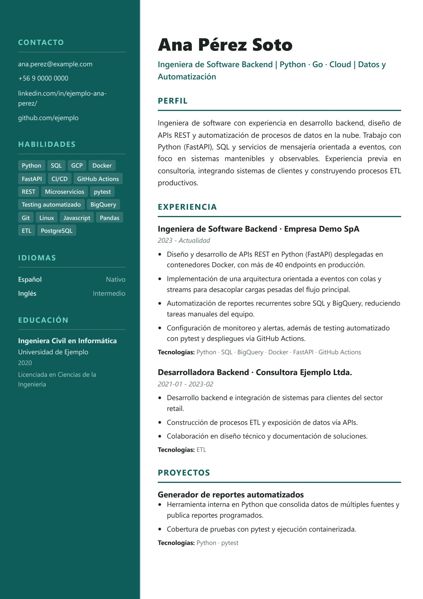

# CV Generator

[](https://github.com/garjona/cv-generator/actions/workflows/tests.yml)
[](https://www.python.org/downloads/)
[](LICENSE)

Generador de CVs adaptados a una oferta laboral concreta. Toma tu CV base y la descripción del puesto, calcula la compatibilidad entre ambos y produce un CV en `HTML/CSS` listo para exportar a PDF.

El pipeline es **determinístico**: el LLM es opcional y sólo se usa para refinar redacción. **Nunca se afirma una skill que no esté confirmada en tu perfil** — las que faltan se reportan como brecha en un informe aparte.



*Salida del template `pro_sidebar` con datos de ejemplo ficticios.*

## Características

- **Entrada flexible**: CV base en `.docx`, `.pdf` o `.md`; oferta en `.html`, `.txt` o texto pegado.
- **Análisis de compatibilidad**: score 0-100, skills coincidentes, brechas y priorización de experiencias según la oferta.
- **Perfil maestro persistente** (SQLite): acumula tu información entre ejecuciones y se exporta a JSON.
- **Preguntas guiadas** para completar información faltante sin inventar datos.
- **Salida HTML/CSS** con plantillas Jinja2, más PDF y JPG por página vía navegador headless.
- **Anti-alucinación**: reglas explícitas para no afirmar experiencia no confirmada.
- **Informe de generación** en Markdown con lo que se priorizó y por qué.

## Arquitectura

Separación por capas (dominio / aplicación / infraestructura), con las dependencias inyectadas desde la CLI:

```
src/cv_generator/
├── domain/           # Modelos y contratos (sin dependencias externas)
├── application/      # Casos de uso: orquestador, matching, redacción, perfil
├── infrastructure/   # Parsers, SQLite, LLM, config, renderizado HTML/Typst
├── interfaces/cli/   # Punto de entrada CLI
└── templates/        # Plantillas HTML/CSS y Typst incluidas
templates/            # Plantillas custom (fuera del paquete)
config/domains/       # Vocabulario por rubro profesional
inputs/candidates/    # Una carpeta por persona (no se versiona)
inputs/examples/      # CV y oferta de ejemplo (datos ficticios)
```

## Requisitos

- Python 3.11+
- Chromium, Chrome o Edge para exportar a PDF *(opcional: usa `--no-pdf` para omitirlo)*
- `typst` sólo si quieres la salida alternativa en Typst

## Instalación

```bash
python -m venv .venv
# Windows
.venv\Scripts\Activate.ps1
# Linux / macOS
source .venv/bin/activate

pip install -r requirements-dev.txt
```

Configuración opcional (para el refinamiento con LLM):

```bash
cp .env.example .env.local
# Edita .env.local y define OPENAI_API_KEY. Sin clave, el pipeline corre igual
# en modo 100% determinístico.
```

## Uso

### Varios candidatos

Cada persona vive en su propia carpeta con su CV, sus ofertas y su perfil:

```
inputs/candidates/
  ana-perez/
    candidate.json        # nombre, dominio, plantilla, datos que no se pueden parsear
    cv.md                 # .md, .docx o .pdf
    jobs/
      empresa-x.txt
    profile.db            # perfil maestro (se crea solo)
```

```bash
python main.py --list-candidates
python main.py --candidate ana-perez --job empresa-x
```

Eso resuelve el CV, la oferta, el perfil, la base de datos y la carpeta de salida
(`outputs/<candidato>/<timestamp>/`).

`candidate.json` mínimo:

```json
{
  "name": "Ana Pérez Soto",
  "domain": "tech",
  "cv": "cv.md",
  "pages": 2,
  "template": "templates/html/custom/pro_sidebar.html.j2",
  "template_css": "templates/html/custom/pro_sidebar.css.j2",
  "basics": { "headline": "Ingeniera de Software Backend", "location": "Santiago, Chile" }
}
```

Lo declarado en `basics` manda sobre lo parseado: hay CVs donde el nombre o el
titular están en una imagen y no se pueden extraer.

### Dominios profesionales

El vocabulario de cada rubro vive en `config/domains/<nombre>.json`, no en el código:

| Campo | Para qué sirve |
| --- | --- |
| `focus_terms` | Términos que priorizan un logro al recortar bullets |
| `skills` | Catálogo reconocible en el CV y en la oferta |
| `canonical_labels` | Cómo se escribe cada skill (`dua` → `DUA (Diseño Universal...)`) |
| `omit_labels` | Skills demasiado genéricas **en ese rubro** |
| `section_aliases` | Encabezados propios (`Competencias pedagógicas` → skills) |
| `labels` | Rótulos del CV (en docencia no se habla de "Tecnologías") |

Incluidos: `tech` y `docencia`. Para crear otro, copia uno y ajústalo:
`--domain <nombre>` o el campo `domain` del candidato.

### Uso directo (sin candidato)

Generar un CV a partir de los ejemplos incluidos:

```bash
PYTHONPATH=src python main.py \
  --cv-file inputs/examples/cv_ejemplo.md \
  --job-file inputs/examples/oferta_ejemplo.txt \
  --render-format html \
  --template-file templates/html/custom/pro_sidebar.html.j2 \
  --template-css-file templates/html/custom/pro_sidebar.css.j2 \
  --pages 2 \
  --no-interactive \
  --output-dir outputs/demo
```

En PowerShell, define la variable de entorno aparte y usa acentos graves para los saltos de línea:

```powershell
$env:PYTHONPATH="src"
python main.py `
  --cv-file inputs\examples\cv_ejemplo.md `
  --job-file inputs\examples\oferta_ejemplo.txt `
  --render-format html `
  --template-file templates\html\custom\pro_sidebar.html.j2 `
  --template-css-file templates\html\custom\pro_sidebar.css.j2 `
  --pages 2 `
  --no-interactive `
  --output-dir outputs\demo
```

Si omites `--output-dir`, se crea una carpeta con timestamp (`outputs/AAAAMMDD_HHMMSS`).

Los archivos se nombran a partir del candidato (`CV_Nombre_Apellido.pdf`) en vez de un genérico `output_cv.pdf`, para que el archivo se vea profesional al descargarlo. Puedes forzar otro nombre con `--output-name`.

### Opciones principales

| Opción | Descripción |
| --- | --- |
| `--cv-file` | CV base (`.docx`, `.pdf`, `.md`). **Requerido** |
| `--job-file` / `--job-text` | Oferta laboral como archivo o texto plano. **Requerido** (excluyentes) |
| `--pages` | Páginas objetivo: `1` o `2` (default `1`) |
| `--render-format` | `html` (default) o `typst` |
| `--template-file` | Plantilla custom `.html.j2` |
| `--template-css-file` | CSS custom `.css` o `.css.j2` |
| `--template-adapter-file` | Adapter JSON para mapear el contexto canónico a otra plantilla |
| `--profile-id` | ID del perfil maestro (default `default`) |
| `--candidate` | Slug en `inputs/candidates/` (resuelve CV, oferta, perfil y salida) |
| `--job` | Nombre de la oferta dentro de `jobs/` del candidato |
| `--domain` | Dominio profesional (`tech`, `docencia`, ...) |
| `--list-candidates` | Lista los candidatos configurados |
| `--db-path` | Ruta del SQLite del perfil maestro |
| `--output-name` | Nombre base de los archivos generados (default: `CV_Nombre_Apellido`) |
| `--no-interactive` | Omite las preguntas guiadas |
| `--no-pdf` | No intenta compilar a PDF |
| `--no-jpg-pages` | No exporta JPG por página |
| `--jpg-dpi` | Resolución de los JPG (default `180`) |

### Plantillas incluidas

| Plantilla | Estilo |
| --- | --- |
| `templates/html/custom/pro_sidebar` | Dos columnas con banda lateral de color, sans-serif. **Recomendada** |
| `templates/html/custom/arjona_two_col_model` | Dos columnas serif, tono editorial |
| `html_ats` (interna) | Una columna, orientada a lectores automáticos (ATS) |
| `typst_ats` (interna) | Salida alternativa en Typst |

## Archivos generados

En el directorio de salida:

- `CV_Nombre_Apellido.html` y `.css` — CV renderizado
- `CV_Nombre_Apellido.pdf` — si hay navegador headless disponible
- `CV_Nombre_Apellido_page_N.jpg` — una imagen por página
- `cv_generation_report.md` — score, coincidencias, brechas y decisiones aplicadas
- `job_posting_normalized.json`, `cv_base_normalized.json`, `master_profile.json`, `template_context.json`
- `execution.log`

## Docker

La imagen incluye Chromium, por lo que el PDF se genera sin instalar nada más:

```bash
docker compose build
docker compose run --rm cvgen python main.py \
  --cv-file /app/inputs/examples/cv_ejemplo.md \
  --job-file /app/inputs/examples/oferta_ejemplo.txt \
  --render-format html \
  --template-file templates/html/custom/pro_sidebar.html.j2 \
  --template-css-file templates/html/custom/pro_sidebar.css.j2 \
  --pages 2 \
  --no-interactive \
  --output-dir /app/outputs/demo
```

Para la variante con Typst, usa el servicio `cvgen-typst`.

## Tests

```bash
PYTHONPATH=src pytest -q
```

## Privacidad

`inputs/`, `data/` y `outputs/` están en `.gitignore`: los CVs reales, el perfil maestro (SQLite) y los documentos generados **no se versionan**. Los únicos datos incluidos en el repositorio son los ejemplos ficticios de `inputs/examples/`.

Si defines `OPENAI_API_KEY`, hazlo en `.env.local` (ignorado por git), nunca en `.env.example`.

## Limitaciones conocidas

- La detección de skills se basa en una lista de tecnologías conocidas (`COMMON_SKILLS`), por lo que puede omitir tecnologías muy nuevas o de nicho.
- Los CVs muy maquetados (tablas anidadas, títulos como imagen) pueden perder encabezados; el parser avisa y aplica heurísticas de rescate, pero conviene revisar el informe.
- El objetivo de páginas es una guía: el contenido real puede desbordar y requerir ajuste manual.

## Licencia

[MIT](LICENSE)
